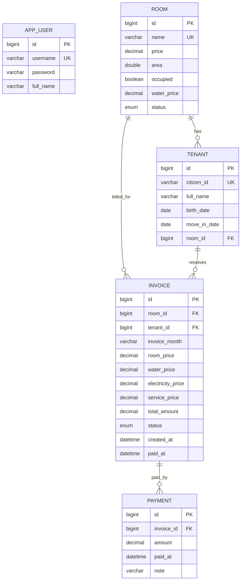

# Motel Management Database Design

## Docker Database

The Docker demo uses MySQL 8.4.

```text
Database: motel_db
Host: localhost
Port: 3307
User: motel_user
Password: motel_password
Root password: root123456
```

Adminer runs at:

```text
http://localhost:8081
```

Use these Adminer values:

```text
System: MySQL
Server: motel-mysql
Username: motel_user
Password: motel_password
Database: motel_db
```

## ERD



## Tables

### app_user

Stores manager login accounts for the demo.

| Column | Type | Note |
| --- | --- | --- |
| id | BIGINT | Primary key |
| username | VARCHAR | Unique login username |
| password | VARCHAR | Demo plain password |
| full_name | VARCHAR | Display name |

### room

Stores motel rooms.

| Column | Type | Note |
| --- | --- | --- |
| id | BIGINT | Primary key |
| name | VARCHAR | Unique room name, for example `A101` |
| price | DECIMAL | Monthly room price |
| area | DOUBLE | Room area in square meters |
| occupied | BOOLEAN | Quick occupied flag |
| water_price | DECIMAL | Water unit or fixed demo price |
| status | ENUM | `AVAILABLE`, `OCCUPIED`, `MAINTENANCE` |

### tenant

Stores tenant information and current room.

| Column | Type | Note |
| --- | --- | --- |
| id | BIGINT | Primary key |
| citizen_id | VARCHAR(12) | Unique citizen ID |
| full_name | VARCHAR | Tenant name |
| birth_date | DATE | Date of birth |
| move_in_date | DATE | Move-in date |
| room_id | BIGINT | References `room.id` |

### invoice

Stores monthly invoices.

| Column | Type | Note |
| --- | --- | --- |
| id | BIGINT | Primary key |
| room_id | BIGINT | References `room.id` |
| tenant_id | BIGINT | References `tenant.id` |
| invoice_month | VARCHAR(7) | Format `MM/yyyy`, for example `05/2026` |
| room_price | DECIMAL | Room price |
| water_price | DECIMAL | Water charge |
| electricity_price | DECIMAL | Electricity charge |
| service_price | DECIMAL | Service charge |
| total_amount | DECIMAL | Total invoice amount |
| status | ENUM | `UNPAID`, `PAID` |
| created_at | DATETIME | Created time |
| paid_at | DATETIME | Paid time, nullable |

### payment

Stores payment history.

| Column | Type | Note |
| --- | --- | --- |
| id | BIGINT | Primary key |
| invoice_id | BIGINT | References `invoice.id` |
| amount | DECIMAL | Paid amount |
| paid_at | DATETIME | Payment time |
| note | VARCHAR | Payment note |

## Demo Rows

### Rooms

| id | name | price | area | status |
| --- | --- | ---: | ---: | --- |
| 1 | A101 | 2500000 | 20 | OCCUPIED |
| 2 | A102 | 2300000 | 18 | AVAILABLE |
| 3 | B201 | 3000000 | 25 | OCCUPIED |
| 4 | C301 | 2800000 | 22 | MAINTENANCE |

### Tenants

| id | citizen_id | full_name | room |
| --- | --- | --- | --- |
| 1 | 001203000001 | Nguyen Van An | A101 |
| 2 | 001204000002 | Tran Thi Binh | B201 |

### Invoices

| id | month | tenant | total | status |
| --- | --- | --- | ---: | --- |
| 1 | 05/2026 | Nguyen Van An | 3020000 | UNPAID |
| 2 | 04/2026 | Tran Thi Binh | 3620000 | PAID |

## Useful SQL

```sql
SELECT name, price, area, status
FROM room;

SELECT t.full_name, r.name AS room_name, t.move_in_date
FROM tenant t
JOIN room r ON r.id = t.room_id;

SELECT i.invoice_month, t.full_name, i.total_amount, i.status
FROM invoice i
JOIN tenant t ON t.id = i.tenant_id
ORDER BY i.created_at DESC;

SELECT SUM(total_amount) AS revenue
FROM invoice
WHERE status = 'PAID';
```
